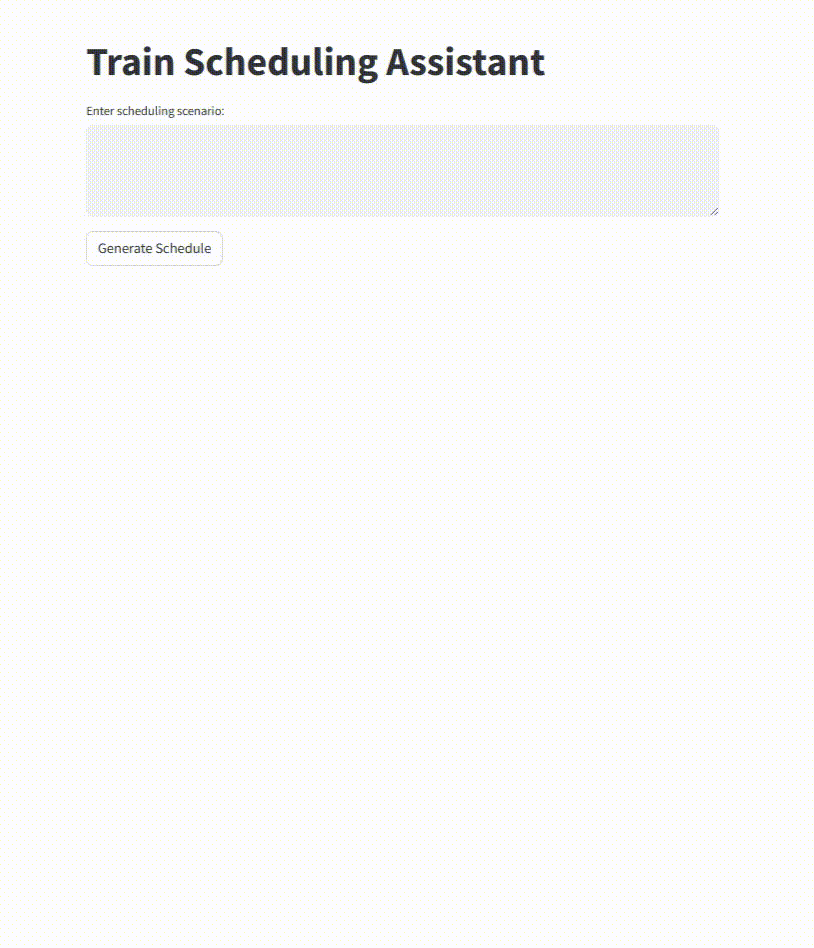

## Train Scheduling with Large Language Models

This project utilizes a fine-tuned Large Language Model (LLM) to generate train scheduling information from unstructured textual data, providing an interactive UI via Streamlit.

## Demo
Below is a short demo of the project in action:



### Table of Contents
- [Installation and Setup](#installation-and-setup)
- [Usage](#usage)
- [Project Structure](#project-structure)
- [Technologies Used](#technologies-used)

### Installation and Setup
```bash
git clone https://github.com/fshnkarimi/train_scheduling_assistant.git
cd train_scheduling_assistant
pip install -r requirements.txt
```

### Usage
Run the Streamlit app locally:
```bash
streamlit run app.py
```
Navigate to `http://localhost:8501` in your web browser to interact with the application.

### Project Structure
- `llm/`: Contains files related to the fine-tuning and usage of the LLM.
- `data/`: Store your synthetic and real-world data for training and evaluation.
- `nlp/`: Contains Natural Language Processing utilities for text preprocessing and information extraction.
- `models/`: Place to store the fine-tuned LLM model.
- `app.py`: Streamlit application for user interaction and visualization.
- `requirements.txt`: List of Python dependencies required for the project.

### Technologies Used
- Python
- PyTorch
- Hugging Face Transformers
- Streamlit
- Docker
- Kubernetes


